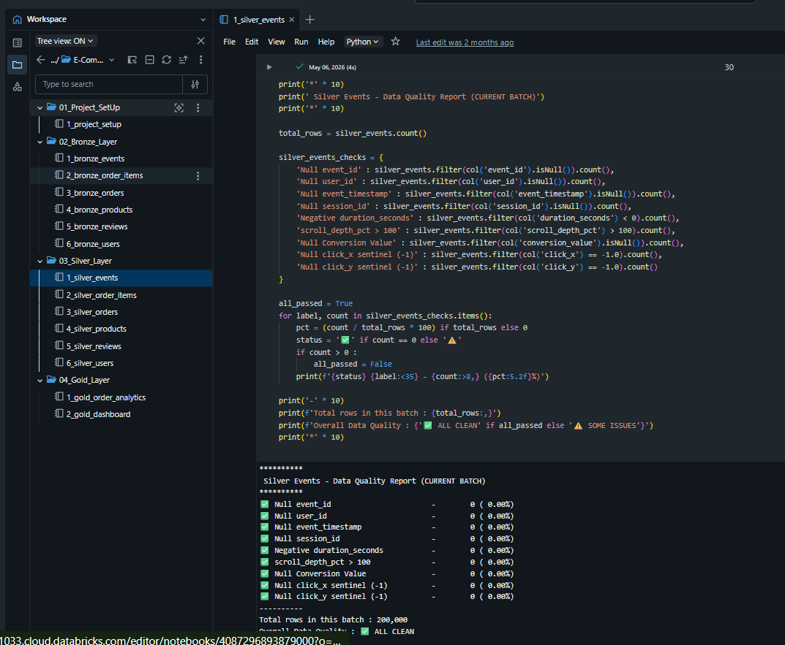
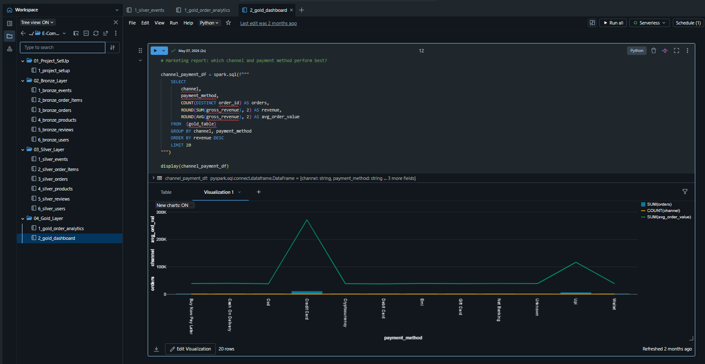

# 🛒 E-Commerce Analytics Lakehouse
### End-to-End Medallion Architecture Pipeline on Databricks + Delta Lake

<div align="center">


</div>

---

## 📌 Project Overview

A **production-style Data Engineering pipeline** that ingests raw e-commerce CSV data from Databricks Unity Catalog Volumes and progressively refines it through Bronze → Silver → Gold layers using Delta Lake, PySpark, and incremental processing patterns.

The pipeline handles **lakhs of rows across 6 business entities** with 35+ columns, applying real-world engineering concerns at every layer — deduplication, watermark-based incremental loads, data quality checks, Delta MERGE upserts, and business-level aggregations for dashboarding.

---

## 🏗️ Architecture

```
┌─────────────────────────────────────────────────────────────────────────┐
│                    Unity Catalog: e_commerce                            │
│                                                                         │
│  Raw CSV Files (Volumes)                                                │
│  /Volumes/e_commerce/default/raw_data_files/                            │
│       │                                                                 │
│       ▼                                                                 │
│  ┌──────────────┐    ┌──────────────┐    ┌──────────────┐               │
│  │  🥉 BRONZE   │───▶│  🥈 SILVER   │───▶│  🥇 GOLD   │              │
│  │  e_commerce  │    │  e_commerce  │    │  e_commerce  │               │
│  │  .bronze     │    │  .silver     │    │  .gold       │               │
│  │              │    │              │    │              │               │
│  │ • Raw ingest │    │ • Dedup      │    │ • Joins      │               │
│  │ • Watermark  │    │ • DQ Checks  │    │ • Aggregates │               │
│  │ • Audit cols │    │ • Delta MERGE│    │ • OPTIMIZE   │               │
│  │ • mergeSchema│    │ • Transforms │    │ • Z-ORDER    │               │
│  └──────────────┘    └──────────────┘    └──────────────┘               │
└─────────────────────────────────────────────────────────────────────────┘
```

> 📸 **Architecture Diagram**
> 

---

## 📊 Dataset

| Entity | Source Files | Key Columns |
|--------|-------------|-------------|
| `events` | events (1).csv, events (2).csv, events-1.csv | event_id, user_id, event_type, session_id, device_type, conversion_value |
| `orders` | orders (1).csv, orders (2).csv | order_id, user_id, status, gross_revenue, country, channel, payment_method |
| `order_items` | order_items (1).csv, order_items (2).csv, order_items-1.csv | item_id, order_id, product_id, quantity, unit_price |
| `products` | products (1).csv, products (2).csv, products-1.csv | product_id, category, launch_date, price |
| `reviews` | reviews (1).csv, reviews (2).csv, reviews-1.csv | review_id, user_id, product_id, rating, sentiment |
| `users` | users (1).csv, users (2).csv, users-1.csv | user_id, membership_tier, country, join_date |

- **Scale:** Lakhs of rows across 20+ CSV files, 35+ columns
- **Storage:** Databricks Unity Catalog Volumes (`/Volumes/e_commerce/default/raw_data_files/`)
- **Format:** Delta Lake (ACID-compliant, time-travel enabled)

---

## 🗂️ Repository Structure

```
E-Commerce-Analytics-Lakehouse/
│
├── 01_Project_SetUp/
│   └── 1_project_setup.py          # Unity Catalog creation (catalog + 3 schemas)
│
├── 02_Bronze_Layer/
│   ├── 1_bronze_events.py
│   ├── 2_bronze_order_items.py
│   ├── 3_bronze_orders.py
│   ├── 4_bronze_products.py
│   ├── 5_bronze_reviews.py
│   └── 6_bronze_users.py
│
├── 03_Silver_Layer/
│   ├── 1_silver_events.py
│   ├── 2_silver_order_items.py
│   ├── 3_silver_orders.py
│   ├── 4_silver_products.py
│   ├── 5_silver_reviews.py
│   └── 6_silver_users.py
│
└── 04_Gold_Layer/
    ├── 1_gold_order_analytics.py   # Cross-entity joins + business aggregations
    └── 2_gold_dashboard.py         # Revenue, geography, loyalty, channel reports
```

---

## ⚙️ Pipeline Deep-Dive

### 🥉 Bronze Layer — Raw Ingestion with Incremental Control

Each Bronze notebook ingests raw CSV from Unity Catalog Volumes and implements a **watermark-based incremental strategy** using the primary key of each entity.

**Key Pattern:**
```python
# Check if bronze table exists → find max primary key already loaded
if spark.catalog.tableExists(bronze_table_name):
    max_event_id = spark.sql(
        f'SELECT COALESCE(MAX(event_id), -1) AS max_id FROM {bronze_table_name}'
    ).collect()[0]['max_id']
else:
    max_event_id = -1

# Filter source CSV to only new rows
events_df = events_df.filter(col('event_id') > max_event_id)

# Append with schema evolution support
events_df.write.format('delta').mode('append') \
    .option('mergeSchema', 'true') \
    .saveAsTable(bronze_table_name)
```

**What each Bronze notebook adds:**
- `_ingest_timestamp` — exact timestamp this row entered the pipeline
- `_source_file_name` — sourced from `_metadata.file_name` (Auto Loader metadata column)
- Incremental filtering to avoid reprocessing rows already in the table

---

### 🥈 Silver Layer — Cleaning, Deduplication & Delta MERGE

Silver is where raw data becomes **trusted, queryable data**. Each notebook follows a consistent 7-step pattern:

| Step | What Happens |
|------|-------------|
| **1. Watermark Read** | Reads `MAX(_ingest_timestamp)` from Silver to know where last run stopped |
| **2. Incremental Batch** | Pulls only new Bronze rows using the watermark — avoids full table scans |
| **3. Deduplication** | `Window.partitionBy(merge_key).orderBy(latest_column)` + `row_number() == 1` |
| **4. Type Casting** | Casts all columns to correct types (double, timestamp, boolean, string) |
| **5. Null Handling** | String nulls → "Unknown"; numeric nulls → median/0 via `approxQuantile` |
| **6. Data Quality Report** | Pre-write DQ check on every critical column with count + % flagging |
| **7. Delta MERGE** | `WHEN MATCHED → UPDATE ALL` / `WHEN NOT MATCHED → INSERT ALL` |

**Highlights by entity:**

- **Events:** Boolean normalisation (`yes/y/true → True`), search query context-aware fill (`N/A` for non-search events), `approxQuantile` median imputation for `duration_seconds`
- **Reviews:** Rating range validation (nullifies ratings outside 1.0–5.0), sentiment derivation from rating when null (`Positive/Negative/Neutral/Mixed`)
- **Products:** Dedup window ordered by `launch_date.desc_nulls_last()`
- **Orders:** Status normalisation, tax calculation with correct execution order
- **Users:** Membership tier standardisation
- **Order Items:** Unit price outlier handling

**Silver MERGE pattern:**
```python
silver_delta.alias('silver') \
    .merge(silver_events.alias('new'),
           f'silver.{merge_key} = new.{merge_key}') \
    .whenMatchedUpdateAll() \
    .whenNotMatchedInsertAll() \
    .execute()
```

> 📸 **Silver DQ Report Output** 
> 

---

### 🥇 Gold Layer — Business Aggregations & Dashboard-Ready Tables

Gold joins across all 6 Silver entities into a single **`gold_order_analytics`** wide table, then runs business reports via `2_gold_dashboard.py`.

**Dual Watermark Strategy (unique to Gold):**
```python
# Watermark 1: catches new orders that arrived after last Gold run
# Watermark 2: catches corrections to OLD orders re-processed in Silver
wm = spark.sql(f"""
    SELECT
        COALESCE(MAX(order_date), CAST('{EPOCH_WM}' AS TIMESTAMP)) AS max_order_date,
        COALESCE(MAX(silver_etl_processed_at), CAST('{EPOCH_WM}' AS TIMESTAMP)) AS max_silver_etl_ts
    FROM {gold_table}
""").collect()[0]
```

> Without watermark 2, a corrected order from last month would silently never re-merge into Gold.

**ETL Batch ID:** Every write is stamped with a `uuid4()` batch ID for full lineage tracing.

**Post-Write Optimisation:**
```python
spark.sql(f"""
    OPTIMIZE {gold_table}
    ZORDER BY (user_id, status, country, membership_tier)
""")
```

**Business Reports in Gold Dashboard:**

| Report | SQL Aggregation |
|--------|----------------|
| Revenue by Year & Month | `SUM(gross_revenue)` grouped by `order_year, order_month` |
| Revenue by Country | Geography drilldown with `AVG(delivery_days)` |
| Order Status Distribution | `COUNT(*)` per status with revenue and return units |
| Membership Tier Revenue | Loyalty analysis with `AVG(user_avg_review_rating)` |
| Channel & Payment Mix | Marketing attribution across `channel × payment_method` |

> 📸 **Gold Dashboard Output** 
> 

---

## 🛠️ Tech Stack

| Technology | Role in Project |
|-----------|----------------|
| **Databricks** | Compute platform, notebook execution, Jobs orchestration |
| **Apache Spark (PySpark)** | Distributed data processing across all layers |
| **Delta Lake** | ACID storage format, MERGE, time travel, schema evolution |
| **Unity Catalog** | Catalog/schema/table governance (`e_commerce.bronze/silver/gold`) |
| **Python** | Pipeline logic, watermark control, DQ checks |
| **SQL (Spark SQL)** | Gold aggregations, dashboard queries, validation |

---

## 🚀 How to Run

### Prerequisites
- Databricks workspace with Unity Catalog enabled
- Cluster with DBR 13.x+ (for `_metadata` column support)
- Raw CSV files uploaded to `/Volumes/e_commerce/default/raw_data_files/`

### Execution Order

```
Step 1 → 01_Project_SetUp/1_project_setup.py
          Creates: e_commerce catalog + bronze/silver/gold schemas

Step 2 → 02_Bronze_Layer/ (run all 6, any order)
          Creates: 6 Delta tables in e_commerce.bronze

Step 3 → 03_Silver_Layer/ (run all 6, any order)
          Creates: 6 Delta tables in e_commerce.silver

Step 4 → 04_Gold_Layer/1_gold_order_analytics.py
          Creates: gold_order_analytics wide table

Step 5 → 04_Gold_Layer/2_gold_dashboard.py
          Runs: business reports (display output in Databricks)
```

> ✅ Every notebook is **idempotent** — safe to re-run. Incremental watermarks ensure no duplicate data is written.

---

## 🔑 Key Engineering Concepts Demonstrated

```
✅  Medallion Architecture (Bronze / Silver / Gold)
✅  Incremental Processing — watermark strategy at every layer
✅  Delta Lake MERGE (upsert semantics for SCD-style updates)
✅  Deduplication via Window functions (row_number + partitionBy)
✅  Data Quality checks with row-level flagging and % reporting
✅  Schema Evolution (mergeSchema on Bronze writes)
✅  Null Handling — median imputation, context-aware fills, sentinels
✅  Dual Watermark in Gold (new orders + corrected old orders)
✅  OPTIMIZE + Z-ORDER for query performance on Gold
✅  ETL Audit Columns (_ingest_timestamp, etl_processed_at, etl_batch_id)
✅  Unity Catalog governance (3-level namespace: catalog.schema.table)
✅  Boolean normalisation, rating range validation, sentiment derivation
```

---

## 📸 Screenshots


| Screenshot | Description |
|-----------|-------------|
| `screenshots/raw_data_files.png` | Unity Catalog Volumes — raw CSV structure |
| `screenshots/bronze_output.png` | Bronze watermark log + row count |
| `screenshots/silver_dq_report.png` | Silver pre-write DQ check output |
| `screenshots/gold_dashboard.png` | Gold business report display output |
| `screenshots/delta_table.png` | Delta table details / history in Databricks UI |

---

## 👤 Author

***Jaya Surya***
Data Engineer · PySpark · Databricks · Delta Lake · Medallion Architecture

<p align="center">
  <a href="mailto:jayasuryapuralasetti@gmail.com">
    
  </a>
  <a href="https://www.linkedin.com/in/jaya-surya-puralasetti/" target="_blank">
    
  </a>
  <a href="https://jayasuryapuralasetti.online" target="_blank">
    
  </a>
</p>


